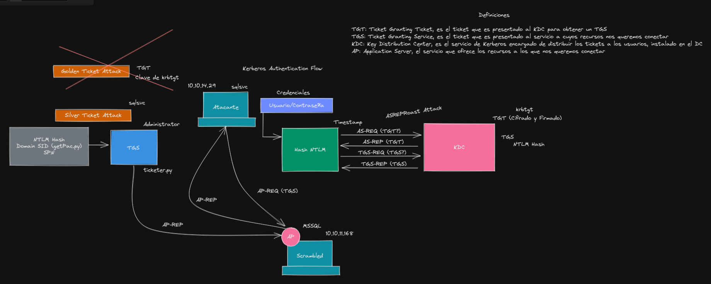

https://www.youtube.com/watch?v=osmFGqnFe8c&ab_channel=S4viOnLive%28BackupDirectosdeTwitch%29

### Definiciones
- **TGT (Ticket Granting Ticket)**: Es el ticket que es presentado al KDC para obtener un TGS.
- **TGS (Ticket Granting Service)**: Es el ticket que es presentado al servicio a cuyos recursos nos queremos conectar.
- **KDC (Key Distribution Center)**: Es el servicio de Kerberos encargado de distribuir los tickets a los usuarios, instalado en el DC.
- **AP (Application Server):** Servicio que ofrece los recursos a los que nos queremos presentar.
- **NTLM:** Es un protocolo patentado por Microsoft para la autenticación, almacena las contraseñas de los sistemas Windows, se pueden usar para los miembros de un grupo de trabajo, también para la autenticación de inicio de sesión local en los controladores de dominio o **DC**   
- **SPN: Service Principal Name.** Estos deben estar asociados a un objeto de **AD**, ya sea un pc, un grupo o un usuario, en el cual el servicio se ejecuta, su función principal es dar soporte a una autenticación entre cliente y servicio.  
- **Domain SID:** Son un identificador de seguridad para los usuarios o grupos, y es único dentro de cualquier dominio dentro de una empresa Un ejemplo de un SID es S-1-5-21-2857466466-1465059943-1690550265-500. Un **SID** siempre comienza con S-. El siguiente número identifica la versión del SID, en este caso, la versión 1. El siguiente número indica la autoridad del identificador y suele ser 5, que es NT Authority. La cadena de números hasta 500 es el identificador de dominio, y el resto del **SID** es un identificador relativo, que es la cuenta o grupo. Esta es una descripción muy aproximada del formato **SID**, que es mucho más complejo de lo que caracteriza el anterior ejemplo mostrado.

### ASREPRoast Attack
Solicitamos un TGT conociendo un usuario existente del AD sin necesidad de contraseña.

### Silver Ticket Attack
Enviar un AP-REQ al AP con un TGS generado sin necesidad de solicitarlo al KDC.

Requisitos:
- NTLM Hash
- DC SID
- SPN

ticketer.py

### Golden Ticket Attack
Con la clave de krbgt podemos generar TGS.

### Referencias:
- https://shuciran.github.io/posts/Silver-Ticket/
- https://the-h4x0r.weebly.com/silver-ticket-attack.html
- https://www.youtube.com/watch?v=osmFGqnFe8c