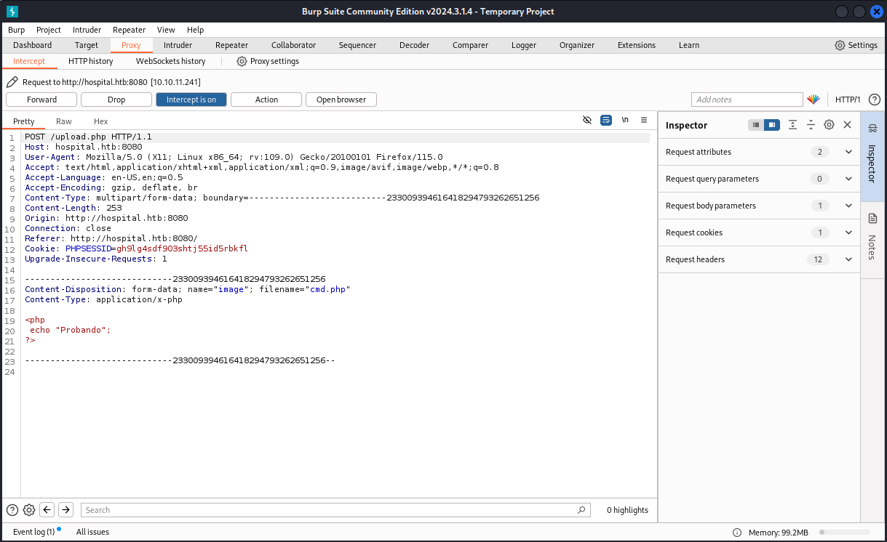
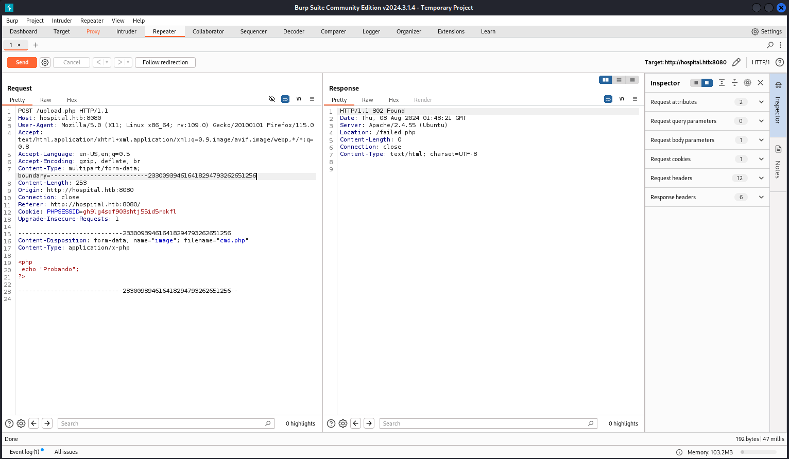
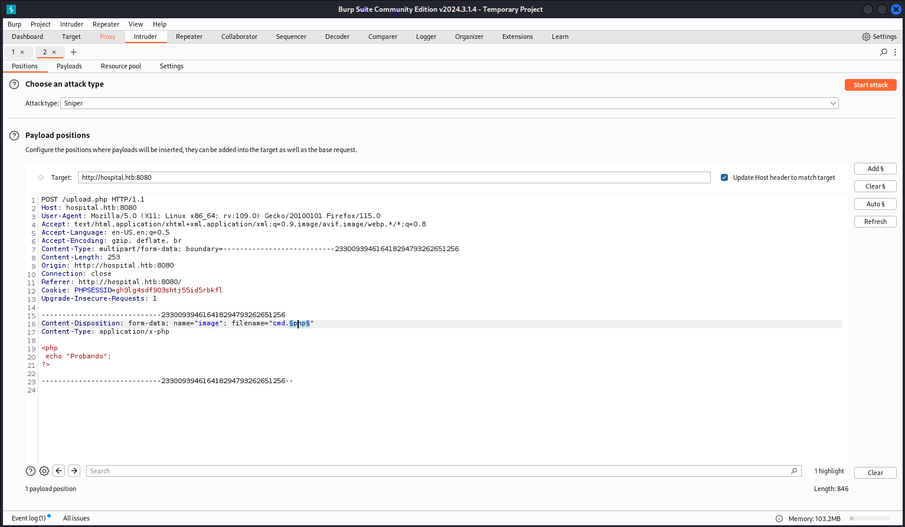
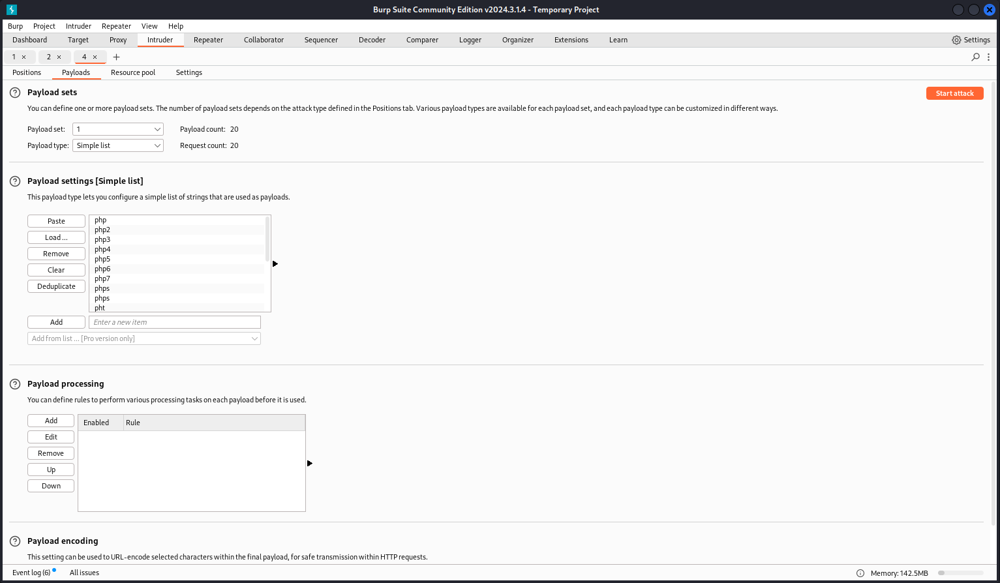
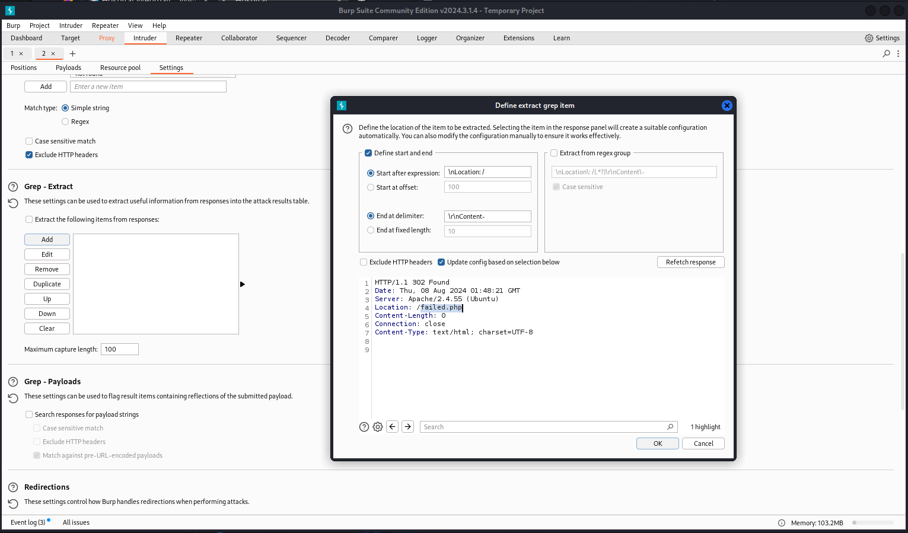
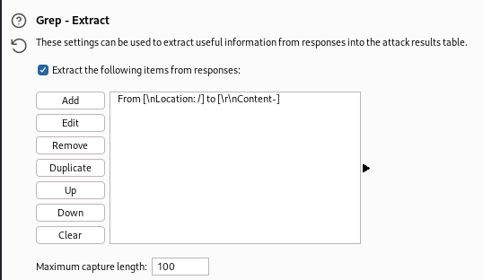
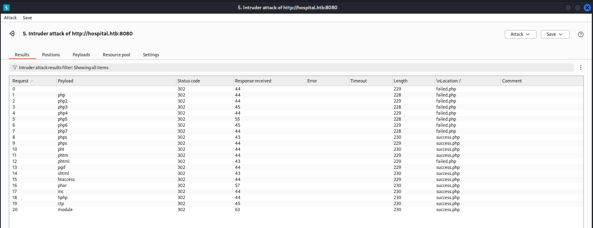

HTB: Hospital2

Vamos a capturar la subida del fichero para ver como podemos forzar la subida del fichero php.

Enviamos esto al `Repeater` y enviamos la solicitud.

Vemos que la web nos redirige a `failed.php`, así que vamos a enviar la petición al `intruder` para intentar determinar que extensiones son validas.

Seleccionamos la extensión como payload y cargamos las extensiones que pueden ejecutar php.
https://book.hacktricks.xyz/pentesting-web/file-upload#bypass-file-extensions-checks

Luego vamos a `Grep - Extract`  y seleccionamos a donde apunta la redirección para que nos lo añada como columna.

Con todo configurado lanzamos el ataque.

Una vez terminado el ataque parece ser que hay varias extensiones que podrían interpretar nuestro payload php: `.phps, .phps, .pht, .phtm, .pgif, .shtml, .htaccess, .phar, .inc, .hphp, .ctp, .module`
